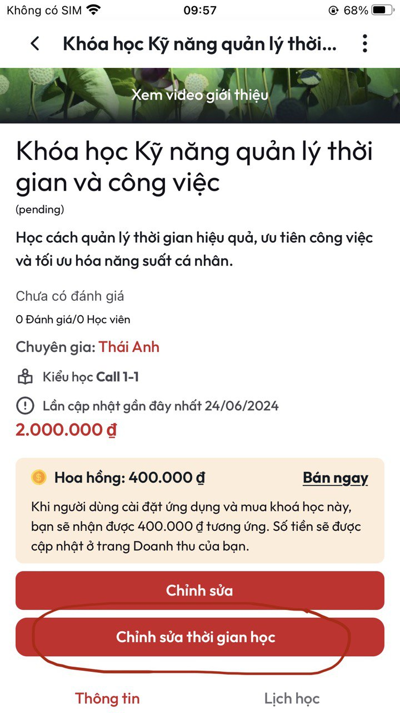
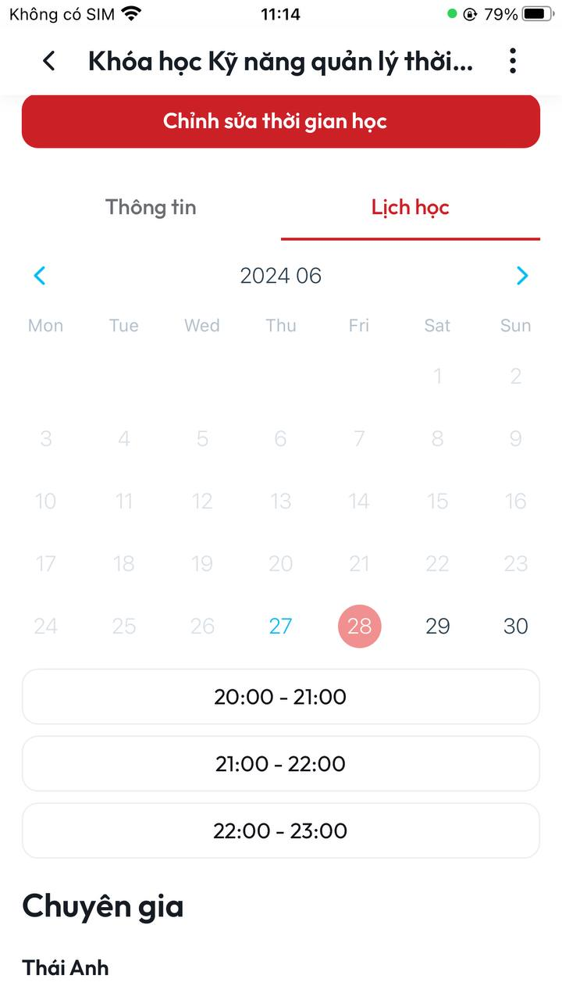

# \[1 - 1] Hướng dẫn cài đặt lịch học

**B1:** Tại màn **Chi tiết khoá** học ấn chọn **Chỉnh sửa thời gian học**

<figure><figcaption>
<em>Màn Chi tiết khoá học</em>
</figcaption></figure>

**B2:** Sau khi thực hiện xong **B1** sẽ vào màn **Thời gian học** \

<figure><figcaption>
<em>Màn thời gian học</em>
</figcaption></figure>

**B3:** Tại màn **Thời gian học** ấn chọn khung thời gian mà bạn rảnh (**\*\*Lưu ý: chọn khoảng thời gian phù hợp với thời lượng khoá học mà bạn đã tạo**). Sau khi chọn xong khung thời gian bạn ấn chọn nút **Lưu**

<figure><figcaption></figcaption></figure>

**B4:** Sau khi thực hiện xong **B3** sẽ quay về màn **Chi tiết khoá học** đồng thời hiển thị thông báo **Tạo thành công**&#x20;

<figure><figcaption></figcaption></figure>

**B5:** Để xem lại lịch học tại màn **Chi tiết khoá học** ấn chọn Tab **Lịch học**

<figure><figcaption></figcaption></figure>
