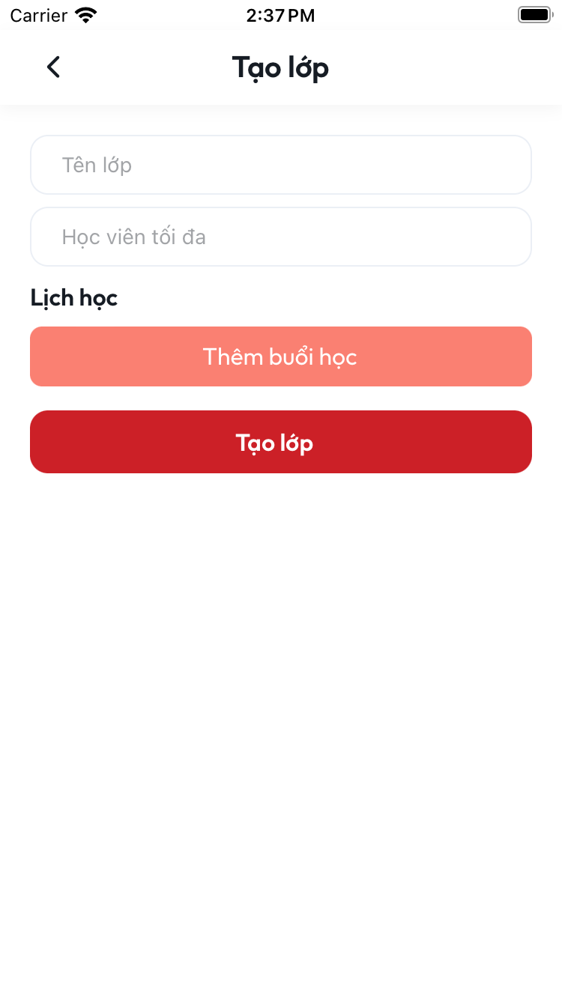
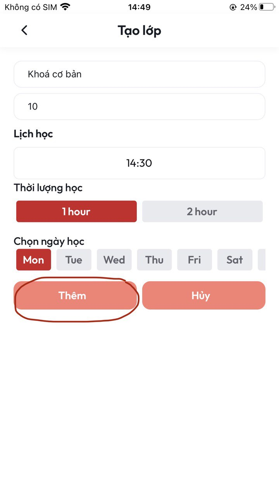
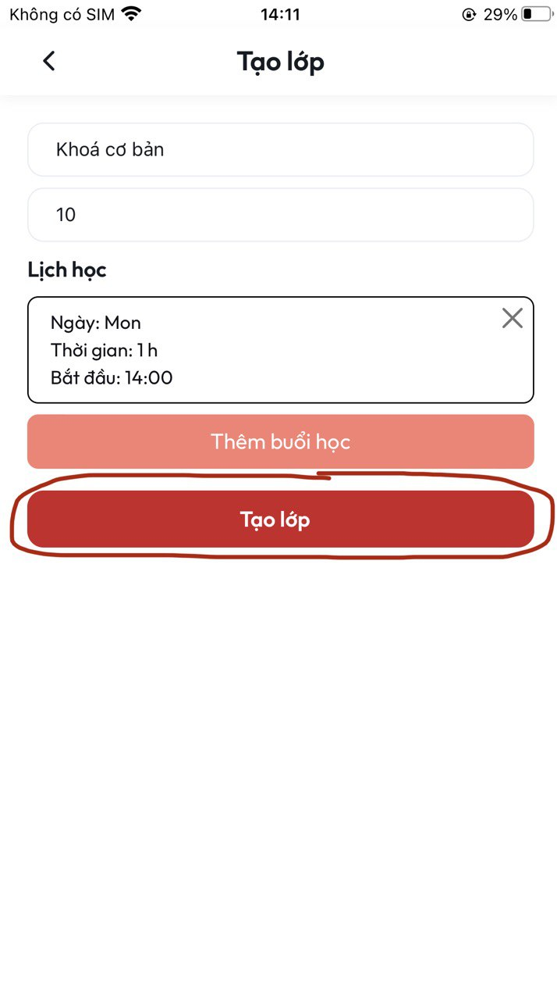
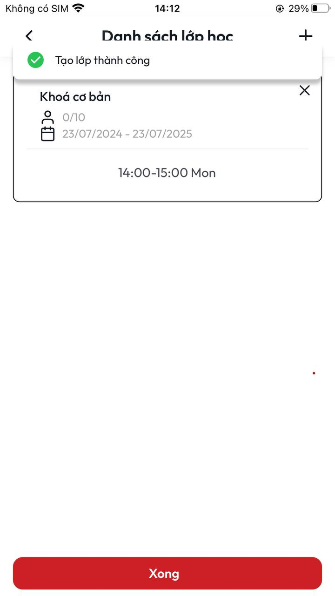
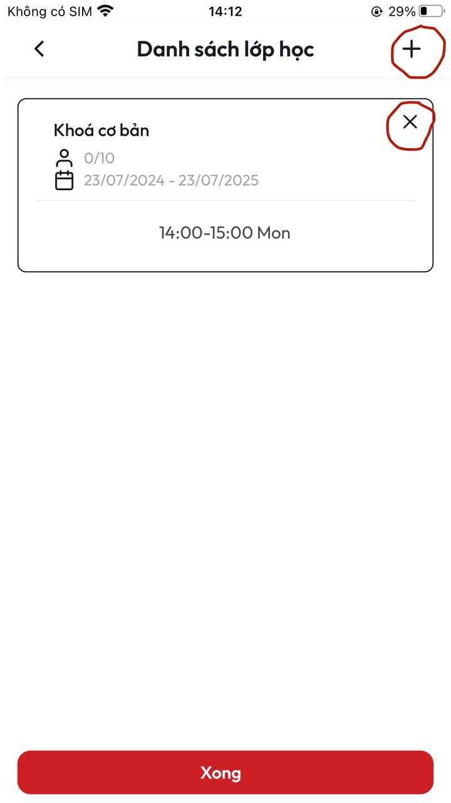
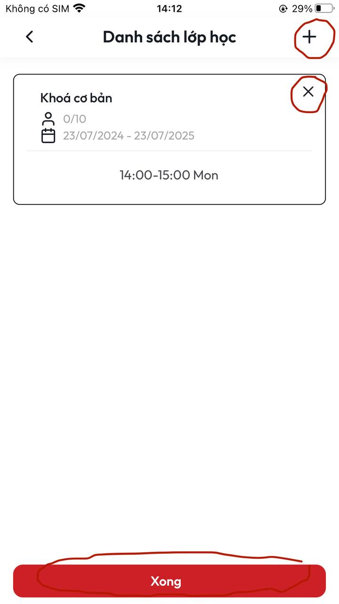

# \[Call Group] Hướng dẫn tạo lớp học

**B1:** Tại màn **Chi tiết khoá học** ấn chọn nút **Chỉnh sửa thời gian học**&#x20;

<figure><figcaption>
<em>Màn Chi tiết khoá học</em>
</figcaption></figure>

**B2:** Sau khi thực hiện xong **B1** sẽ vào màn **Danh sách lớp học**. Tại màn này ấn chọn nút **Tạo lớp**&#x20;

<figure><figcaption>
<em>Màn Danh sách lớp học</em> 
</figcaption></figure>

**B3:** Sau khi thực hiện xong **B2** sẽ vào màn **Tạo lớp**

<figure><figcaption>
<em>Màn Tạo lớp</em>
</figcaption></figure>

**B4:** Tại màn **Tạo lớp** điền đầy đủ thông tin&#x20;

* **Tên lớp (Bắt buộc):** Tại đây bạn điền Tên lớp học của mình&#x20;
* **Học viên tối đa (Bắt buộc):** Tại đây bạn điền số lượng học của một lớp mà bạn mong muốn

<figure><figcaption>
<em>Màn Tạo lớp</em>
</figcaption></figure>

**B5:** Sau khi thực hiện xong **B4** tiếp tục ấn chọn nút **Thêm buổi học**&#x20;

* **Lịch học (Bắt buộc):** Tại đây bạn chọn thời gian bắt đầu cho lớp học này&#x20;
* **Thời lượng học (Bắt buộc):** Có 2 lựa chọn cho bạn với 2 khung thời gian là 1 giờ và 2 giờ
* **Chọn ngày học (Bắt buộc):** Tại đây bạn chọn ngày trong tuần để bắt đầu lớp học&#x20;

<figure><figcaption>
<em>Màn Tạo lớp</em>
</figcaption></figure>

**B6:** Sau khi thực hiện xong **B5** ấn chọn nút **Thêm**&#x20;

<figure><figcaption>
<em>Màn Tạo lớp</em> 
</figcaption></figure>

**B7:** Sau khi thực hiện xong **B6** màn hình sẽ thêm khung thời gian vừa tạo sau đó ấn chọn nút **Tạo lớp** (**\*\* Lưu ý:** Bạn có thể **Xoá** khung thời gian bằng cách ấn chọn dấu **X** ở phía trên bên phải của khung thời gian này hoặc có thể **Thêm** thời gian học bằng cách ấn chọn nút **Thêm buổi học** ở ngày phía dưới khung thời gian vừa tạo)

<figure><figcaption>
<em>Màn Tạo lớp</em>
</figcaption></figure>

**B8:** Sau khi thực hiện xong **B7** sẽ về màn **Danh sách lớp học** đồng thời hiển thị thông báo **Tạo lớp học thành công**

<figure><figcaption>
<em>Màn Danh sách lớp học</em>
</figcaption></figure>

(\*\*Lưu ý: Bạn có thể **Xoá** khung thời gian bằng cách ấn chọn dấu **X** ở phía trên bên phải của lớp học hoặc **Thêm** lớp học bằng cách ấn chọn dấu **+** phía trên bên phải màn hình rồi thực hiện lại thao tác đã được hướng dẫn ở phía trên)

<figure><figcaption>
<em>Màn Danh sách lớp học</em>
</figcaption></figure>

**B9:** Tại **B8** ấn chọn nút **Xong**&#x20;

<figure><figcaption>
<em>Màn Danh sách lớp học</em>
</figcaption></figure>

**B10:** Sau khi thực hiện xong **B9** sẽ về màn **Chi tiết khoá học** lúc này khoá học của bạn đã có lớp học&#x20;

<figure><figcaption></figcaption></figure>
