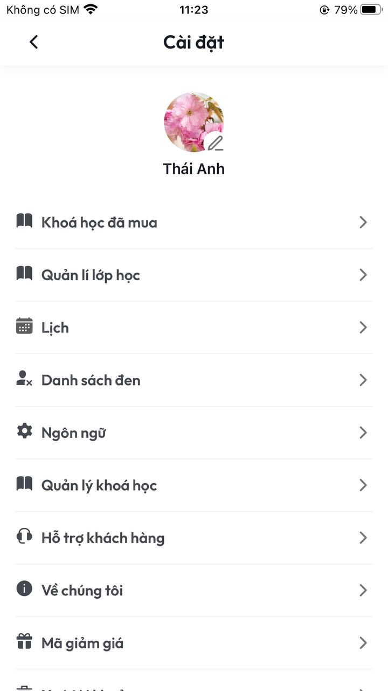
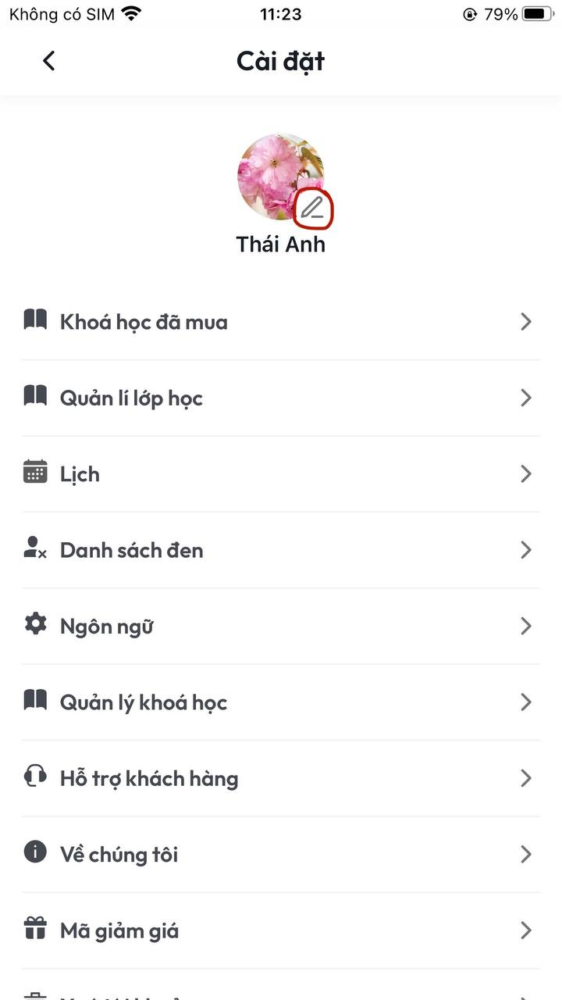
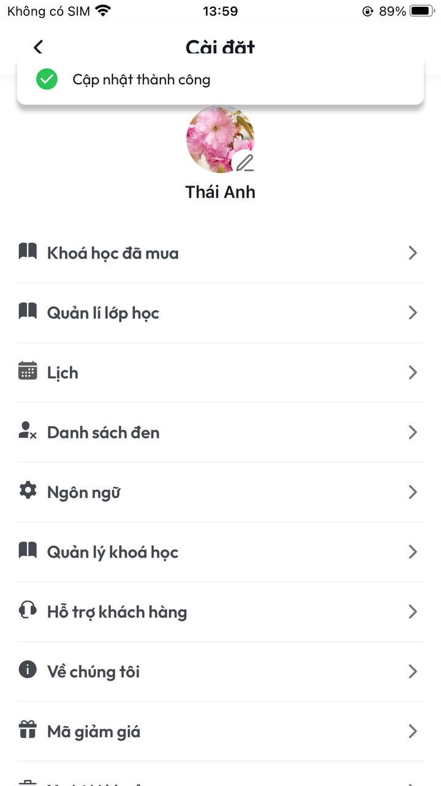

# Hướng dẫn chỉnh sửa Profile giáo viên

**I. CHỈNH SỬA THÔNG TIN GIÁO VIÊN**

**B1:** Tại màn **Hồ sơ** chọn **Tên tài khoản** được khoanh trong vòng tròn đỏ dưới hình&#x20;

<figure><figcaption>
<em>Màn Hồ sơ</em>
</figcaption></figure>

**B2:** Sau khi thực hiện xong **B1** sẽ vào màn **Cài đặt**

<figure><figcaption>
<em>Màn Cài đặt</em>
</figcaption></figure>

**B3:** Tại màn **Cài đặt** chọn biểu tượng **Cây bút** được khoanh tròn đỏ dưới hình **(\*\*Lưu ý: Chỉ chọn vào cây bút tránh chọn vào ảnh avatar)**

<figure><figcaption></figcaption></figure>

**B4:** Sau khi thực hiện xong **B3** sẽ vào màn **Sửa hồ sơ**

**B5**: Sau khi thực hiện xong **B4** sẽ quay về màn **Cài đặt** đồng thời hiển thị thông báo **Cập nhật thành công,** lúc này thông tin bạn vừa chỉnh sửa đã được lưu lại.

<figure><figcaption></figcaption></figure>
