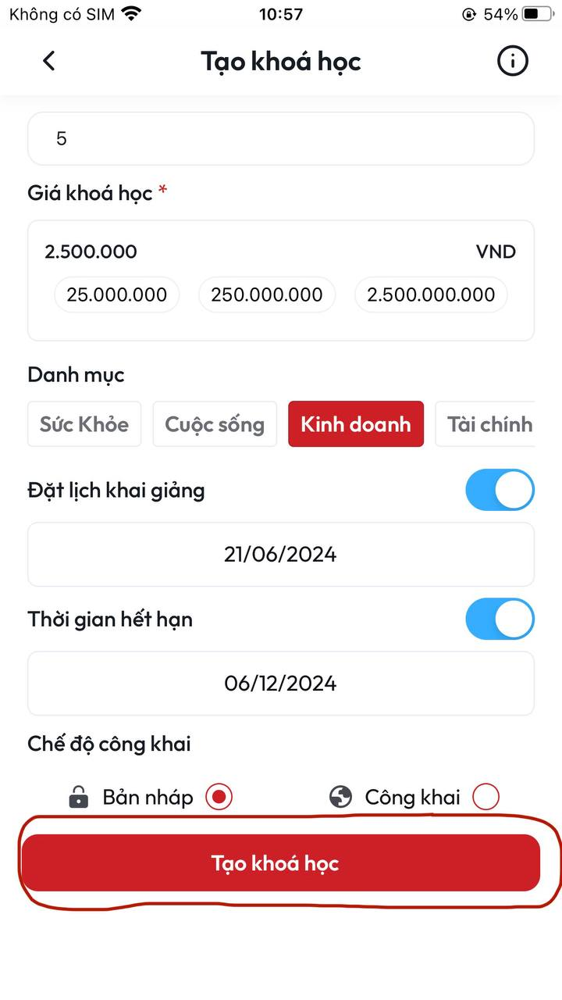

# Hướng dẫn đăng tải khoá học

**B1:** Tại màn **Khoá học** quan sát phía cuối màn hình ấn chọn dấu **+**&#x20;

<figure><figcaption>
<em>Màn Khoá học</em> 
</figcaption></figure>

**B2:** Sau khi thực hiện xong **B1** sẽ vào màn **Tạo khoá học**&#x20;

<figure><figcaption>
<em>Màn Tạo khoá học</em>
</figcaption></figure>

**B3:** Tại màn **Tạo khoá học** điền đầy đủ thông tin đối với yêu cầu **bắt buộc** và tuỳ chỉnh đối với yêu cầu **không bắt buộc**

* **Tải lên ảnh nền (Bắt buộc):** Tại đây bạn tải lên một ảnh nền cho khoá học. Ảnh này sẽ được hiển thị cho khoá học của bạn&#x20;
* **Tải lên video giới thiệu (Bắt buộc):** Tại đây bạn tải lên video cho khoá học. Video này sẽ được hiển thi khi user vào xem ảnh khoá học lúc này video giới thiệu của khoá học sẽ tự động chạy&#x20;
* **Tiêu đề (Bắt buộc):** Tại đây bạn nhập tiêu đề khái quát cho khoá học của mình
* **Mô tả (Bắt buộc):** Tại đây bạn nhập mô tả tóm tắt về nội dung khoá học của mình
* **Chi tiết khoá học (Bắt buộc):** Tại đây bạn nhập đầy đủ thông tin về nội dung, mục tiêu, cầu trúc, phương pháp giảng dạy và các yếu tố quan trọng khác của khoá học
* **Kiểu khoá học (Bắt buộc):** Có 3 kiểu học để bạn lựa chọn bao gồm: **Call 1-1** (là kiểu khoá học mà một giáo viên hoặc huấn luyện viên tập trung chỉ dạy cho một học viên hoặc người học duy nhất), **Call group** (là kiểu khoá học mà một lớp học hoặc một nhóm các học viên tham gia cùng một buổi học trực tuyến, thường được dẫn dắt bởi một giáo viên hoặc huấn luyện viên), **Self-learning** (là kiểu khoá học mà người học có thể tự mình tiếp cận và tiến hành học tập mà không cần có sự giám sát hoặc hướng dẫn trực tiếp từ một giáo viên hay huấn luyện viên)
* **Thời lượng buổi học (Bắt buộc):** Bạn có thể chọn lựa thời lượng buổi học là 30 phút, 1 tiếng, 2 tiếng
* **Số buổi học (Bắt buộc):** Bạn có thể điền số buổi học cho khoá học của mình&#x20;
* **Giá khoá học (Bắt buộc):** Bạn có thể nhập giá khoá học của mình theo mong muốn cá nhân&#x20;
* **Danh mục (Bắt buộc):** Bạn có thể chọn danh mục phù hợp với khoá học của mình
* **Đặt lịch khai giảng (Không bắt buộc):** Chọn lịch bắt đầu khoá học theo ý bạn mong muốn, nếu không chọn sẽ mặc định là ngày hôm nay&#x20;
* **Thời gian hết hạn (Không bắt buộc):** Chọn ngày kết thúc khoá học theo ý bạn mong muốn, nếu không chọn sẽ mặc định là không hết hạn&#x20;
* **Chế độ công khai (Không bắt buộc):** Có 2 lựa chọn **Bản nháp** (là trạng thái chỉ giáo viên đang tạo nhìn thấy được dùng trong trường hợp giáo viên đang hoàn thiện và chưa muốn ai nhìn thấy khoá học), **Công khai** (khi chọn chế độ này khoá học lập tức được đội ngũ của Admin của Ikigai Coach kiểm duyệt, sau khi kiểm duyệt thành công khoá học của bạn sẽ được công khai với tất cả mọi người)

**B4:** Sau khi thực hiện xong **B3** ấn vào nút **Tạo khoá học**

<figure><figcaption></figcaption></figure>

**B5:** Sau khi thực hiện xong **B4** lúc này màn hình sẽ về màn **Chi tiết khoá học**&#x20;

<figure><figcaption>
<em>Màn hình chi tiết khoá học khi chọn chế độ nháp</em>
</figcaption></figure>

<figure><figcaption>
<em>Màn hình chi tiết khoá học khi chọn chế độ công khai</em> 
</figcaption></figure>

