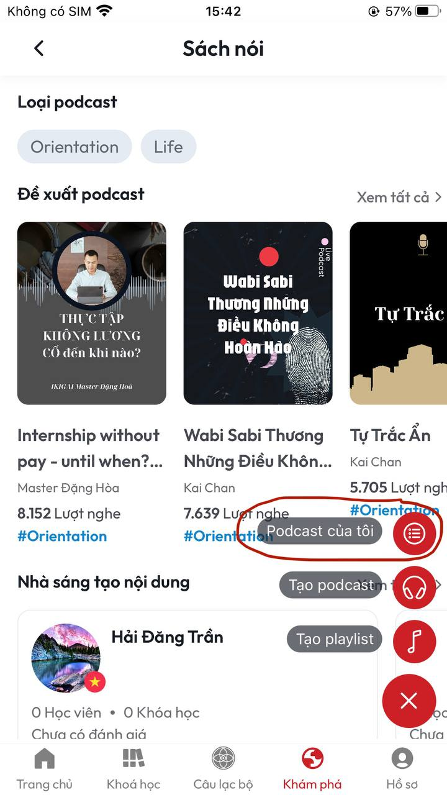
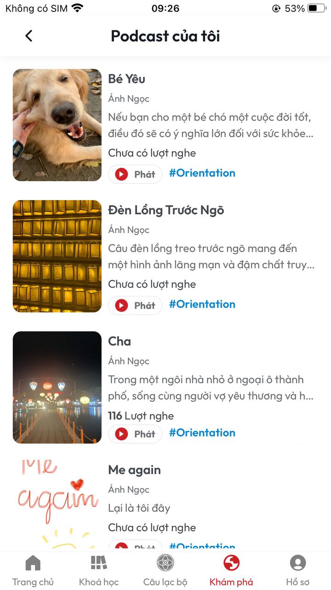

# Hướng dẫn đăng tải một Podcast

**B1:** Tại màn **Sách nói** ấn chọn dấu **+** bên phải phía dưới màn hình

<figure><figcaption>
<em>Màn Sách nói</em>
</figcaption></figure>

**B2:** Sau khi thực hiện xong **B1** lúc này dấu **+** sẽ hiển thị 3 chức năng: **Podcast của tôi, Tạo podcast, Tạo playlist**

<figure><figcaption></figcaption></figure>

**I. HƯỚNG DẪN TẠO PLAYLIST**

**B1:** Tại màn **Sách nói** chọn **Tạo playlist**&#x20;

<figure><figcaption>
<em>Màn sách nói</em>
</figcaption></figure>

**B2:** Sau khi thực hiện xong **B1** sẽ vào màn **Tải lên playlist**

<figure><figcaption>
<em>Màn Tải lên playlist</em>
</figcaption></figure>

**B3:** Tại màn **Tải lên podcast** điền đầy đủ thông tin&#x20;

* **Tải lên ảnh nền:** Tại đây bạn tải lên ảnh nền cho playlist. Ảnh này sẽ được hiển thị cho playlist của bạn
* **Tiêu đề:** Tại đây bạn nhập tiêu đề cho playlist của mình
* **Mô tả:** Tại đây bạn nhập mô tả tóm tắt về nội dung playlist của mình
* **Loại podcast:** Có 2 loại podcast bao gồm: **Công khai** (là kiểu podcast người nghe không phải trả phí để nghe) và **Hội viên** (là kiểu podcast người nghe phải trả phí để nghe)
* **Tải lên âm thanh:** Tại đây bạn tải lên file âm thanh podcast của mình **(\*\*Lưu ý: File âm thanh phải có định dạng: mp3, m4a)**

**B4:** Sau khi thực hiện xong bước **B3** ần vào nút **Tải lên playlist**

<figure><figcaption></figcaption></figure>

**B5:** Sau khi thực hiện xong **B4** lúc này màn hình sẽ về màn **Sách nói** đồng thời hiển thị thông báo **Tải lên podcast thành công**&#x20;

<figure><figcaption></figcaption></figure>

**II. HƯỚNG DẪN TẠO PODCAST**&#x20;

**B1:** Tại màn **Sách nói** chọn **Tạo podcast**&#x20;

<figure><figcaption>
<em>Màn sách nói</em>
</figcaption></figure>

**B2:** Sau khi thực hiện xong **B1** sẽ vào màn **Tải lên podcast**

**III. HƯỚNG DẪN XEM PODCAST CỦA TÔI**

**B1:** Tại màn **Sách nói** chọn **Podcast của tôi**&#x20;

<figure><figcaption>
<em>Màn Sách nói</em>
</figcaption></figure>

**B2:** Sau khi thực hiện xong **B1** sẽ vào màn **Podcast của tôi,** tại màn này sẽ hiển thị podcast của bạn đã tạo&#x20;

<figure><figcaption>
<em>Màn Podcast của tôi</em> 
</figcaption></figure>
