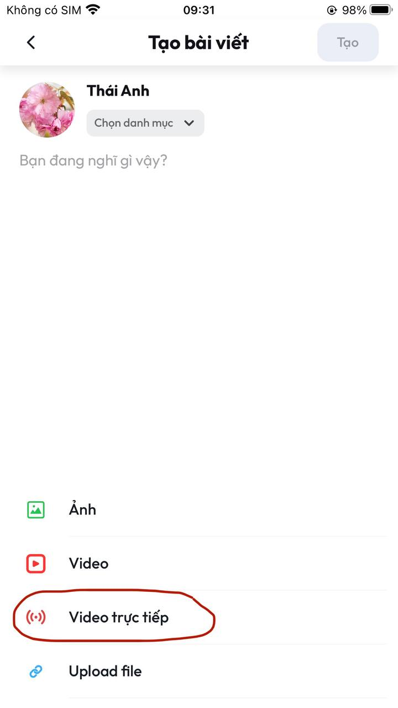
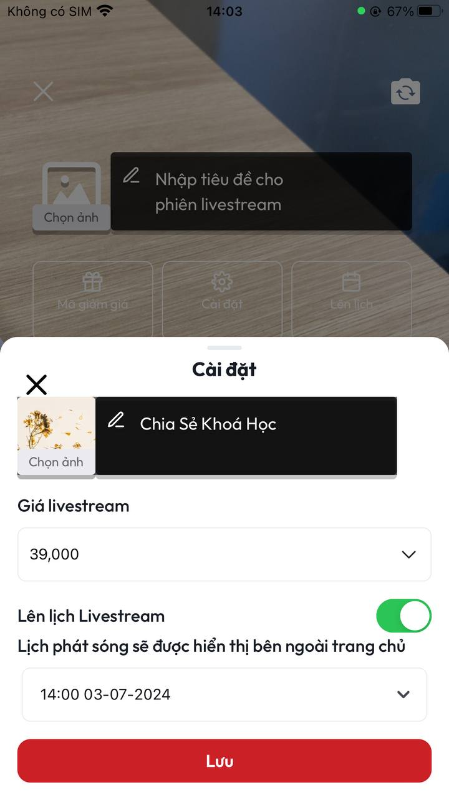

# Hướng dẫn livestream

**B1:** Tại màn **Trang chủ** ấn chọn dấu **+** ở bên phải phía dưới màn hình

<figure><figcaption>
Màn Trang chủ
</figcaption></figure>

**B2:** Sau khi thực hiện xong **B1** sẽ vào màn **Tạo bài viết**. Tại màn này ấn chọn **Video trực tiếp**&#x20;

<figure><figcaption>
<em>Màn Tạo bài viết</em> 
</figcaption></figure>

**B3:** Sau khi thực hiện xong **B2** sẽ vào màn **Khởi tạo livestream** như hình&#x20;

<figure><figcaption>
<em>Màn Khởi tạo livestream</em>
</figcaption></figure>

**B4:** Tại màn **Khởi tạo livestream** có 2 sự lựa chọn cho bạn:

1. **Phát luôn livestream:** Tại màn **Khởi tạo livestream** bạn có thể **Nhấp tiêu đề cho phiên livestream** và **Chọn ảnh bìa** cho livestream của mình. Sau đó bạn ấn chọn luôn vào nút **Bắt đầu trực tiếp** sẽ tự động phát livestream tại thời điểm bạn bắt đầu.
2. **Đặt lịch livestream:**&#x20;

* Tại màn **Khởi tạo livestream** ấn chọn **Cài đặt**&#x20;

<figure><figcaption></figcaption></figure>

* Tại màn **Cài đặt** bạn có thể **Nhấp tiêu đề cho phiên livestream** và **Chọn ảnh bìa** cho livestream, tuỳ chỉnh **Giá livestream, Lên lịch livestream, lên Lịch phát sóng cho livestream.** Sau đó chọn nút **Lưu.**

<figure><figcaption></figcaption></figure>

* Sau khi lưu cấu hình, livestream sẽ về màn **Danh sách livestream** đồng thời hiển thị thông báo Lên lịch thành công

<figure><figcaption></figcaption></figure>
