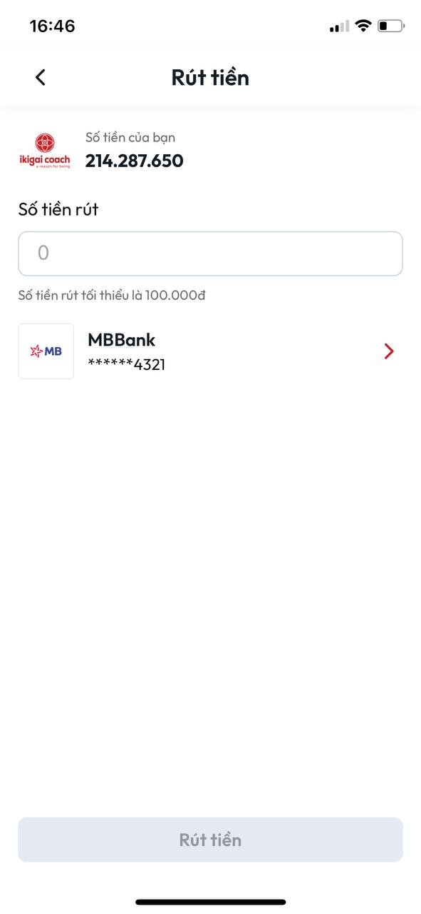
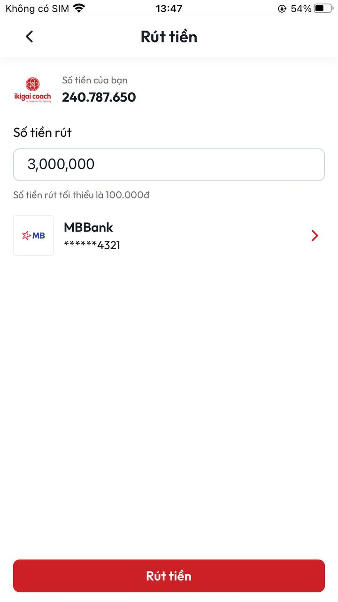

# Hướng dẫn rút tiền

(\*) Lưu ý: Để có thể rút tiền từ App về ngân hàng của bạn điều kiện bắt buộc là bạn phải có ngân hàng trước đó, để có thể thêm được ngân hàng vào tài khoản trên App vui lòng xem **Hướng dẫn thêm ngân hàng vào tài khoản**

**B1: B1:** Tại màn **Trang chủ** chọn nút **Tiếp thị**

<figure><figcaption>
<em>Nút Tiếp thị tại màn Trang chủ</em>
</figcaption></figure>

**B2:** Sau khi chọn nút **Tiếp thị** sẽ mở ra màn **Tiếp thị**&#x20;

<figure><figcaption>
<em><strong>Màn Tiếp thị</strong></em>
</figcaption></figure>

**B3:** Tại màn **Tiếp thị** chọn **Rút tiền**

<figure><figcaption>
<em>Chức nằng Rút tiền tại màn Tiếp thị</em>
</figcaption></figure>

**B4:** Sau khi chọn **Rút tiền** sẽ mở ra màn **Rút tiền**&#x20;

<figure><figcaption>
<em>Màn Rút tiền</em>
</figcaption></figure>

**B5:** Nhập số tiền muốn rút \[(\*) Lưu ý: Số tiền tối thiểu mà bạn được rút là 100.000 vnd ] sau đó ấn vào nút **Rút tiền**&#x20;

<figure><figcaption></figcaption></figure>

**B6:** Sau khi thực hiện xong **B5** sẽ quay về màn **Tiếp thị** đồng thời hiển thị thông báo **Đặt lệnh rút tiền  về tài khoản thành công**

<figure><figcaption></figcaption></figure>

**B7:** Khi rút tiền thành công, lúc lại tại phía chúng tôi sẽ nhận được một thông báo rút tiền của bạn sau đó chúng tôi xem xét giao dịch của bạn và thực hiện chuyển tiền về tài khoản cho bạn (thời gian tối đa để thực hiện giao dịch là 2 ngày trong giờ hành chính ) và thông báo cho bạn sau khi giao dịch thành công

**(\*) Lưu ý: Bạn có thể xem lại lịch sử giao dịch theo hướng dẫn dưới đây**

**B1:** Tại màn **Tiếp thị** chọn **Doanh thu**

<figure><figcaption>
<em>Chức nằng Doanh thu tại màn Tiếp thị</em>
</figcaption></figure>

**B2:** Sau khi thực hiện xong **B1** sẽ mở ra màn **Thu nhập của bạn**

<figure><figcaption>
<em>Màn Doanh thu của bạn</em>
</figcaption></figure>

**B3:** Để xem được giao dịch rút tiền bạn vừa thực hiện ở màn **Thu nhập của bạn** chọn Tab **Rút tiền** lúc này ở Tab **Rút tiền** sẽ hiển thị các giao dịch mà bạn đã thực hiện

<figure><figcaption></figcaption></figure>
