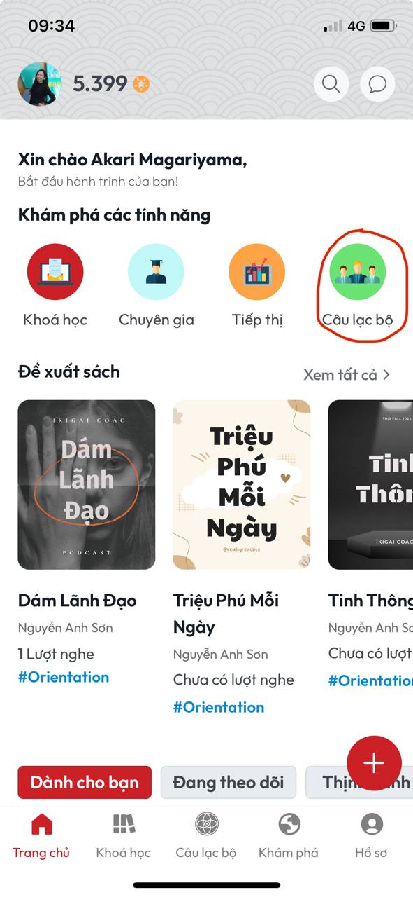
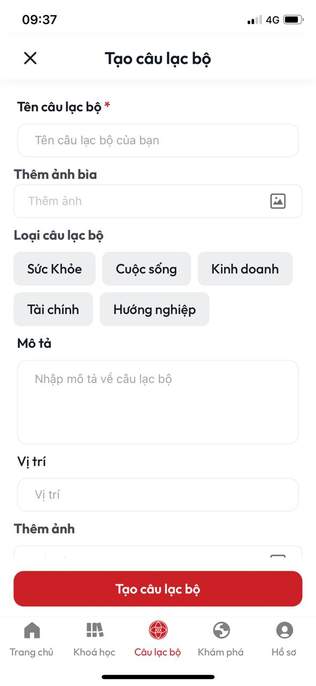
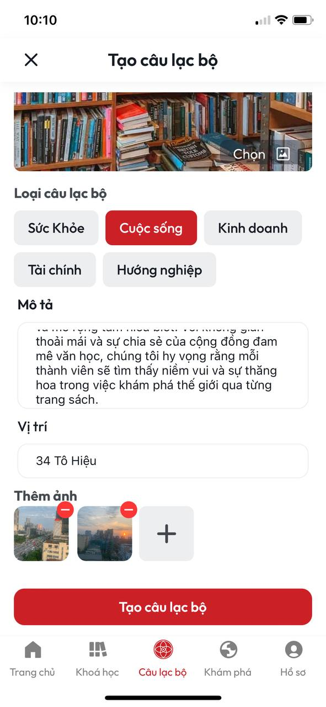
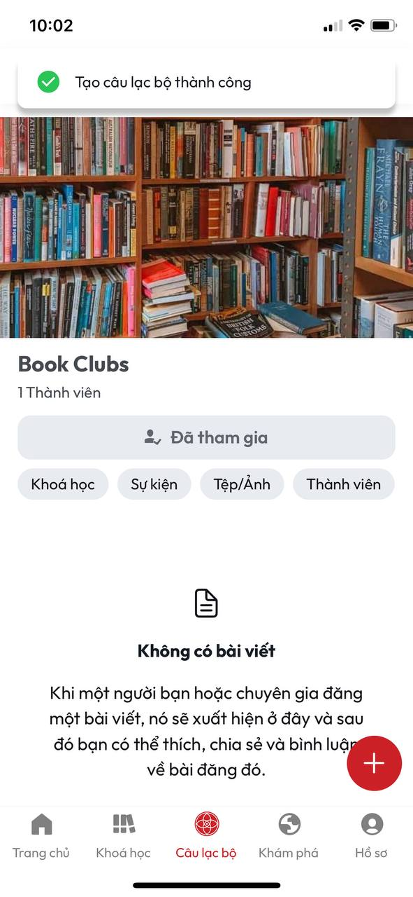

# Hướng dẫn tạo Club mới

**B1:** Tại màn **Trang chủ** chọn nút **Câu lạc bộ**

<figure><figcaption>
<em>Nút Câu lạc bộ tại màn Trang chủ</em>
</figcaption></figure>

**B2:** Sau khi chọn nút **Câu lạc bộ** sẽ mở ra màn **Câu lạc bộ**

<figure><figcaption>
<em>Màn Câu lạc bộ</em>
</figcaption></figure>

**B3:** Tại màn **Câu lạc bộ** chọn Tab **Của bạn**

<figure><figcaption>
<em>Tab Của bạn tại màn Câu lạc bộ</em>
</figcaption></figure>

**B4:** Tại Tab **Của bạn** chọn **Tạo mới**

<figure><figcaption></figcaption></figure>

**B5:** Sau khi thực hiện xong **B4** sẽ mở ra màn **Tạo câu lạc bộ**

<figure><figcaption>
<em>Màn Tạo câu lạc bộ</em>
</figcaption></figure>

**B6:** Sau khi nhập đầy đủ thông tin tại màn **Câu lạc bộ** ấn vào nút **Tạo câu lạc bộ**

<figure><figcaption></figcaption></figure>

**B7:** Sau khi thực hiện xong **B6** sẽ vào màn Chi tiết câu lạc bộ bạn vừa tạo đồng thời hiển thị thông báo **Tạo câu lạc bộ thành công**

<figure><figcaption>
<em>Màn Chi tiết câu lạc bộ bạn vừa tạo</em>
</figcaption></figure>
