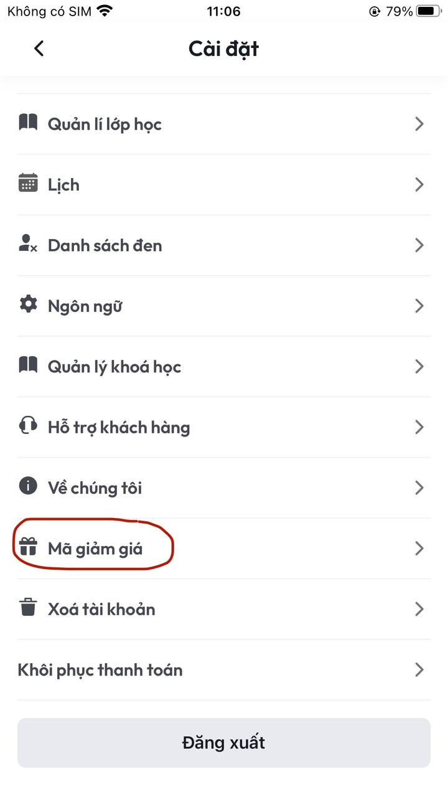
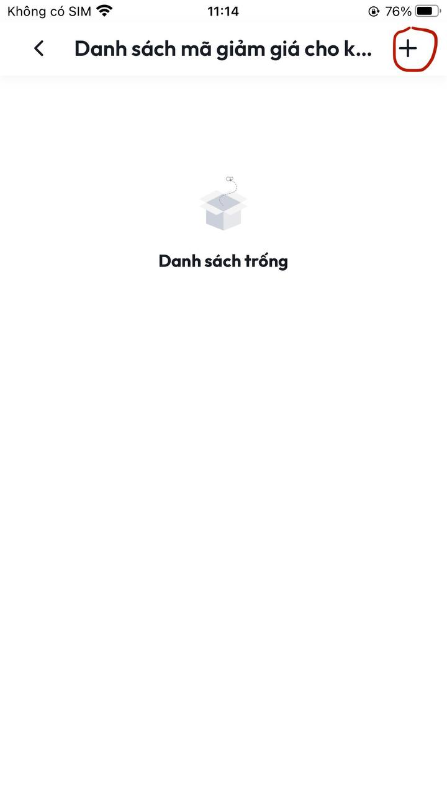
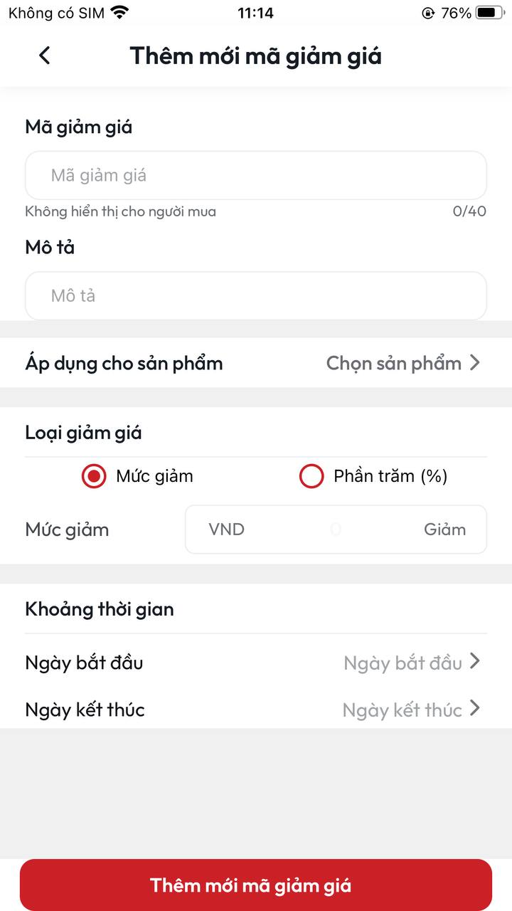

# Hướng dẫn tạo mã giảm giá cho khoá học

**B1:** Tại màn **Cài đặt** chọn **Mã giảm giá**&#x20;

<figure><figcaption>
<em>Màn Cài đặt</em>
</figcaption></figure>

**B2:** Sau khi thực hiện xong **B1** sẽ vào màn **Danh sách mã giảm giá cho khách hàng.** Tại màn này chọn dấu **+** phía trên bên phải màn hình

<figure><figcaption>
<em>Màn Danh sách mã giảm giá cho khách hàng</em>
</figcaption></figure>

**B3:** Sau khi thực hiện xong **B2** sẽ vào màn **Thêm mới mã giảm giá**

<figure><figcaption>
<em>Màn Thêm mới mã giảm giá</em>
</figcaption></figure>

**B4:** Tại màn **Thêm mới mã giảm giá** điền đầy đủ thông tin&#x20;

**Mã giảm giá:**&#x20;
