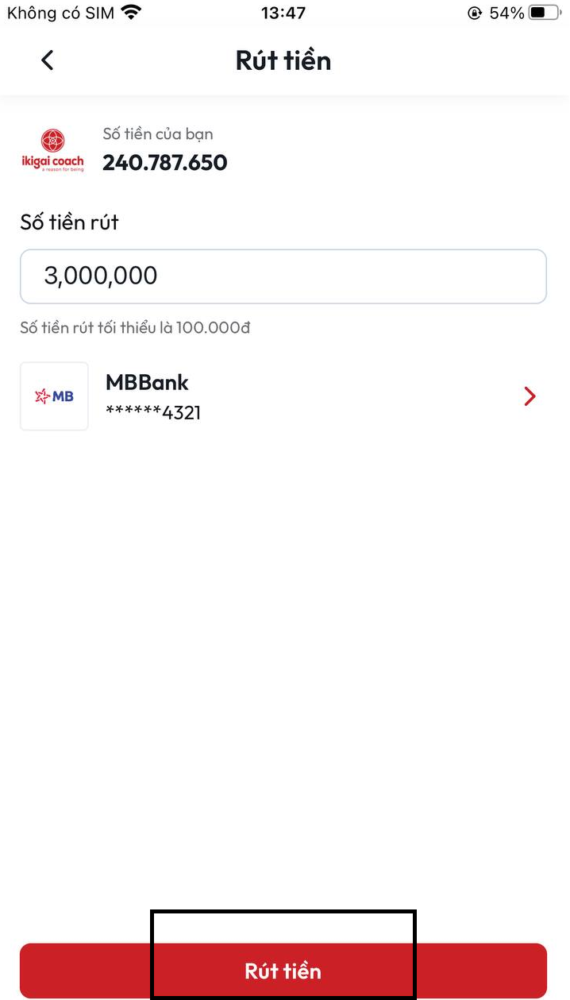

# Hướng dẫn thêm ngân hàng vào tài khoản

**B1:** Tại màn **Trang chủ** chọn nút **Tiếp thị**

<figure><figcaption>
<em>Nút Tiếp thị tại màn Trang chủ</em>
</figcaption></figure>

**B2:** Sau khi chọn nút **Tiếp thị** sẽ mở ra màn **Tiếp thị**&#x20;

<figure><figcaption>
<em><strong>Màn Tiếp thị</strong></em>
</figcaption></figure>

**B3:** Tại màn **Tiếp thị** chọn **Rút tiền**

<figure><figcaption>
<em>Chức nằng Rút tiền tại màn Tiếp thị</em>
</figcaption></figure>

**B4:** Sau khi chọn **Rút tiền** sẽ mở ra màn **Rút tiền**&#x20;

<figure><figcaption>
<em>Màn Rút tiền</em>
</figcaption></figure>

**B5:** Tại màn Rút tiền chọn **Thêm ngân hàng +**&#x20;

<figure><figcaption></figcaption></figure>

**B6:** Sau kho chọn **Thêm ngân hàng +** sẽ mở ra màn **Tài khoản ngân hàng** mặc định có các ngân hàng: VietinBank, Vietcombank, BIDV, AGRIBANK, OCB, MB, TECHCOMBANK.

<figure><figcaption>
<em>Màn Tài khoản ngân hàng</em>
</figcaption></figure>

**B6:** Nếu tài khoản ngân hàng của bạn thuộc những ngân hàng này vui lòng chọn ngân hàng của bạn lúc này sẽ mở ra **Thêm tài khoản ngân hàng**

<figure><figcaption>
<em>Màn Thêm tài khoản ngân hàng của ngân hàng MB</em> 
</figcaption></figure>

**B7:** Sau khi nhập đầy đủ thông tin **Số thẻ/tài khoản** và **Tên chủ thẻ** lúc này nút **Tiếp tục** khả dụng

<figure><figcaption></figcaption></figure>

**B8:** Sau khi thực hiện xong **B7** ấn vào nút **Tiếp tục** sẽ trở về màn **Rút tiền với thông tin tài khoản vừa thêm**&#x20;

<figure><figcaption>
<em>Màn Rút tiền sau khi thêm tài khoản ngân hàng thành công</em> 
</figcaption></figure>

**B9:** Nhập số tiền muốn rút \[(\*) Lưu ý: Số tiền tối thiểu mà bạn được rút là 100.000 vnd ] sau đó ấn vào nút **Rút tiền**

<figure><figcaption></figcaption></figure>

**B10:** Sau khi thực hiện xong **B9** sẽ quay về màn **Tiếp thị** đồng thời hiển thị thông báo Đặt lệnh rút tiền thành công

<figure><figcaption>
<em>Màn hình sau khi người dùng đặt lệnh rút tiền thành công</em>
</figcaption></figure>

B11: Khi rút tiền thành công, lúc lại tại phía chúng tôi sẽ nhận được một thông báo rút tiền của bạn sau đó chúng tôi xem xét giao dịch của bạn và thực hiện chuyển tiền về tài khoản cho bạn (thời gian tối đa để thực hiện giao dịch là 2 ngày trong giờ hành chính ) và thông báo cho bạn sau khi giao dịch thành công

**(\*\* Lưu ý) Bạn có thể xem lại lịch sử giao dịch theo hướng dẫn sau**

**B1:** Tại màn **Tiếp thị** chọn **Doanh thu**

<figure><figcaption>
<em>Chức nằng Doanh thu tại màn Tiếp thị</em>
</figcaption></figure>

**B2:** Sau khi thực hiện xong **B1** sẽ vào màn **Doanh thu của bạn**&#x20;

<figure><figcaption>
<em>Màn Doanh thu của bạn</em>
</figcaption></figure>

**B3:** Để xem được giao dịch rút tiền bạn vừa thực hiện ở màn **Thu nhập của bạn** chọn Tab **Rút tiền** lúc này ở Tab Rút tiền sẽ hiển thị các giao dịch mà bạn đã thực hiện

<figure><figcaption></figcaption></figure>

