# Hướng dẫn thêm ngân hàng vào tài khoản

**B1:** Tại màn **Trang chủ** chọn nút **Tiếp thị**

<figure><figcaption>
<em>Nút Tiếp thị tại màn Trang chủ</em>
</figcaption></figure>

**B2:** Sau khi chọn nút **Tiếp thị** sẽ mở ra màn **Tiếp thị**&#x20;

<figure><figcaption>
<em><strong>Màn Tiếp thị</strong></em>
</figcaption></figure>

**B3:** Tại màn **Tiếp thị** chọn **Rút tiền**

<figure>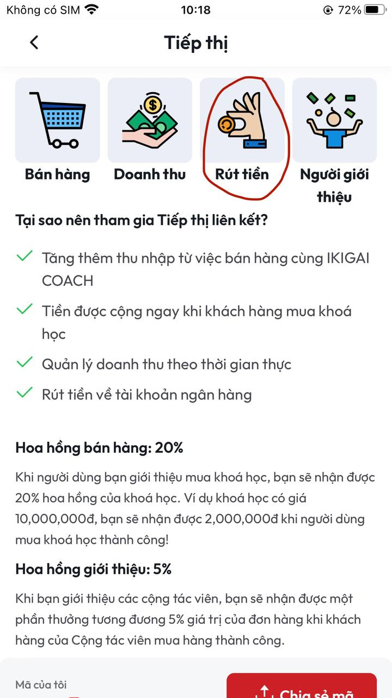<figcaption>
<em>Chức nằng Rút tiền tại màn Tiếp thị</em>
</figcaption></figure>

**B4:** Sau khi chọn **Rút tiền** sẽ mở ra màn **Rút tiền**&#x20;

<figure>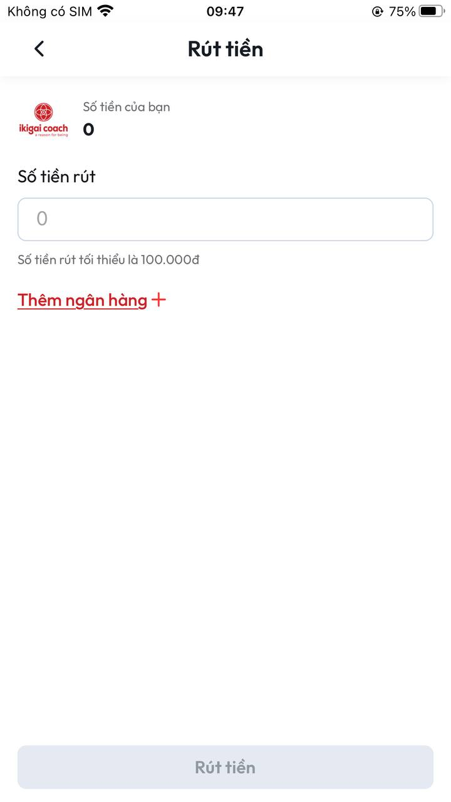<figcaption>
<em>Màn Rút tiền</em>
</figcaption></figure>

**B5:** Tại màn Rút tiền chọn **Thêm ngân hàng +**&#x20;

<figure>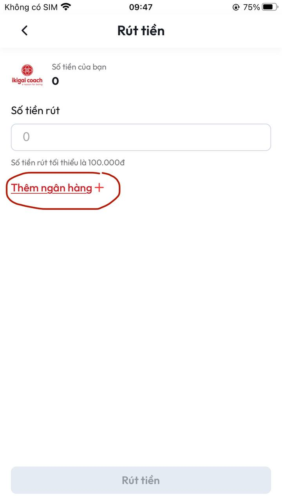<figcaption></figcaption></figure>

**B6:** Sau kho chọn **Thêm ngân hàng +** sẽ mở ra màn **Tài khoản ngân hàng** mặc định có các ngân hàng: VietinBank, Vietcombank, BIDV, AGRIBANK, OCB, MB, TECHCOMBANK.

<figure>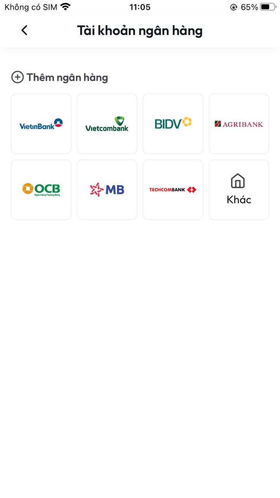<figcaption>
<em>Màn Tài khoản ngân hàng</em>
</figcaption></figure>

**B6:** Nếu tài khoản ngân hàng của bạn thuộc những ngân hàng này vui lòng chọn ngân hàng của bạn lúc này sẽ mở ra **Thêm tài khoản ngân hàng**

<figure>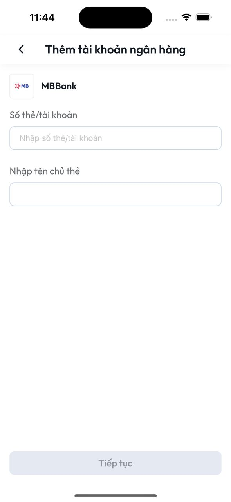<figcaption>
<em>Màn Thêm tài khoản ngân hàng của ngân hàng MB</em> 
</figcaption></figure>

**B7:** Sau khi nhập đầy đủ thông tin **Số thẻ/tài khoản** và **Tên chủ thẻ** lúc này nút **Tiếp tục** khả dụng

<figure><figcaption></figcaption></figure>

**B8:** Sau khi thực hiện xong **B7** ấn vào nút **Tiếp tục** sẽ trở về màn **Rút tiền với thông tin tài khoản vừa thêm**&#x20;

<figure>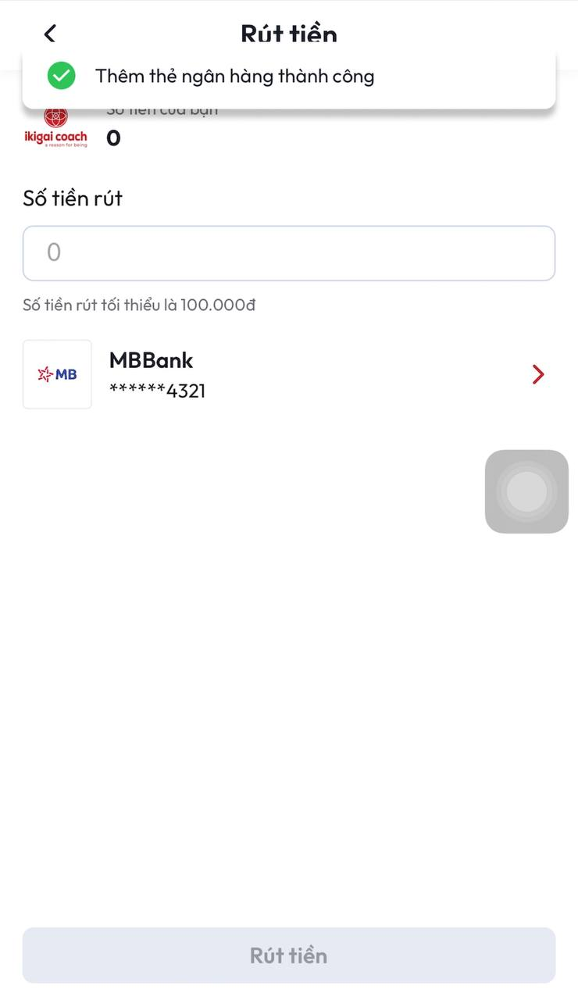<figcaption>
<em>Màn Rút tiền sau khi thêm tài khoản ngân hàng thành công</em> 
</figcaption></figure>

**B9:** Để thêm Ngân hàng khác vào bạn ấn chọn vào ngân hàng vừa thêm&#x20;

<figure>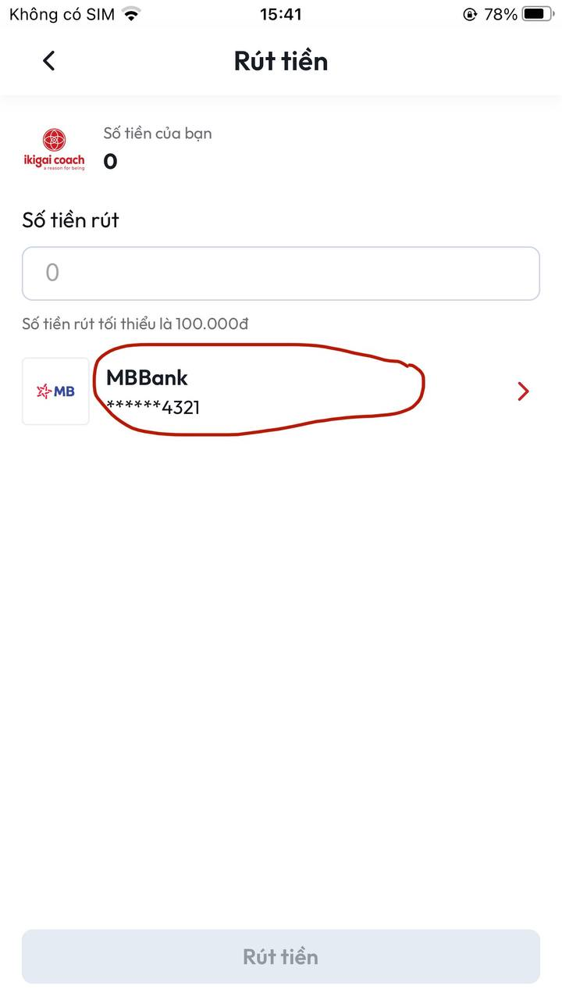<figcaption></figcaption></figure>

**B10:** Sau khi thực hiện xong **B9** sẽ vào màn **Tài khoản ngân hàng** lúc này sẽ có thông tin tài khoản bạn đã thêm trước đó&#x20;

<figure>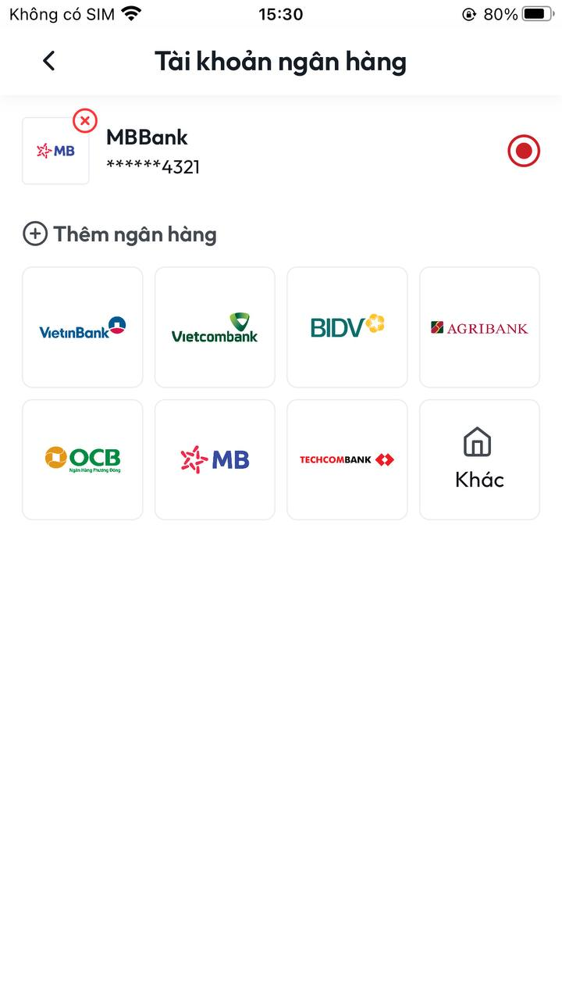<figcaption>
<em>Màn Tài khoản ngân hàng sau khi thêm tài khoản</em>
</figcaption></figure>

**B11:** Tại màn này bạn có thể thêm ngân hàng khác bằng cách ấn chọn nút **Thêm ngân hàng** hoặc **Khác**

<figure>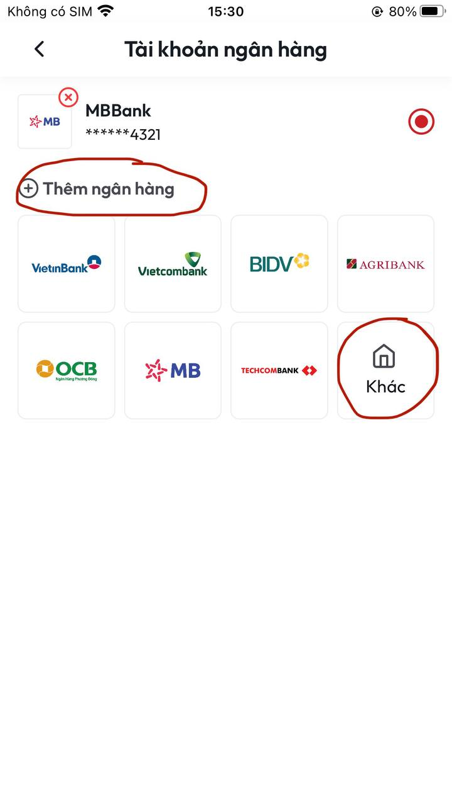<figcaption></figcaption></figure>

**B12:** Sau khi ấn vào 1 trong 2 nút này màn hình sẽ hiển thị thêm popup **Chọn ngân hàng**

<figure>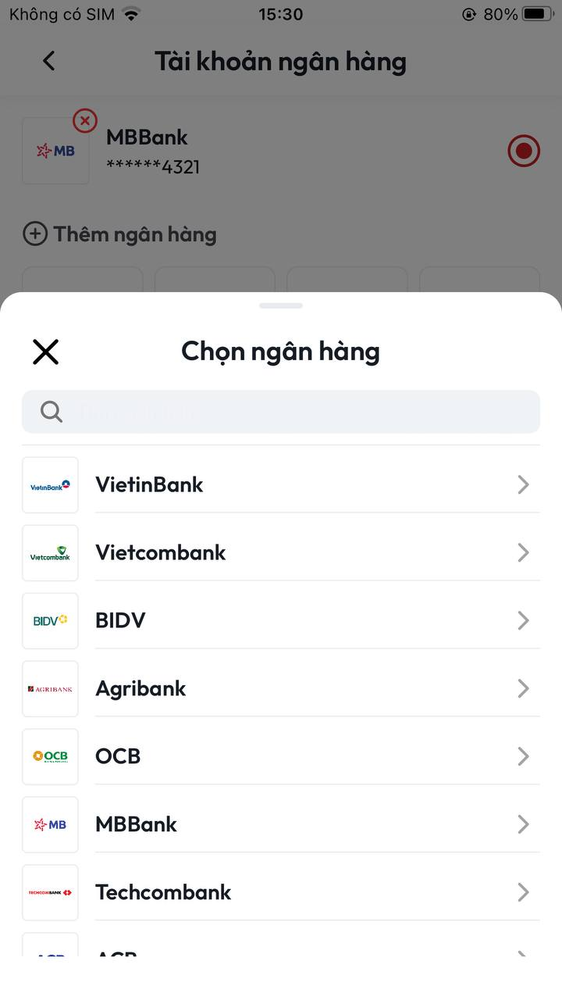<figcaption>
<em>Popup Chọn ngân hàng</em>
</figcaption></figure>

**B13:** Thực hiện chọn ngân hàng mà bạn muốn thêm rồi thao tác như **B6**, **B7** sau khi thực hiện xong màn hình sẽ hiển thị ngân hàng bạn vừa thêm

<figure><figcaption></figcaption></figure>

**B14:** Để quản lý các tài khoản ngân hàng bạn ấn chọn vào ngân hàng vừa thêm lúc này sẽ mở ra màn **Tài khoản ngân hàng** hiển thị đầy đủ danh sách các ngân hàng bạn đã thêm&#x20;

<figure>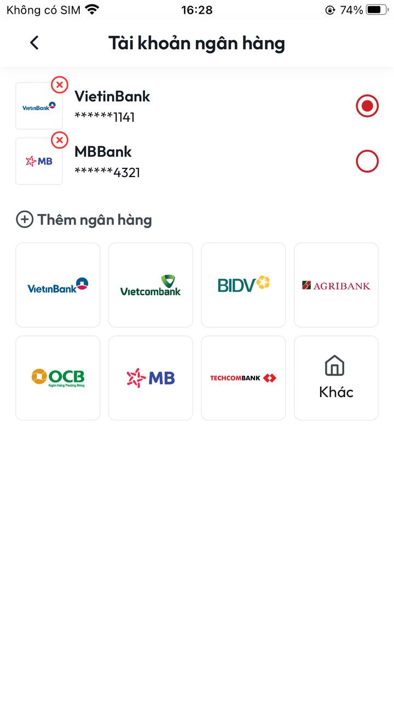<figcaption></figcaption></figure>

**B15:** Để xoá tài khoản ngân hàng bất kì chọn đấu **X** ở logo ngân hàng&#x20;

<figure>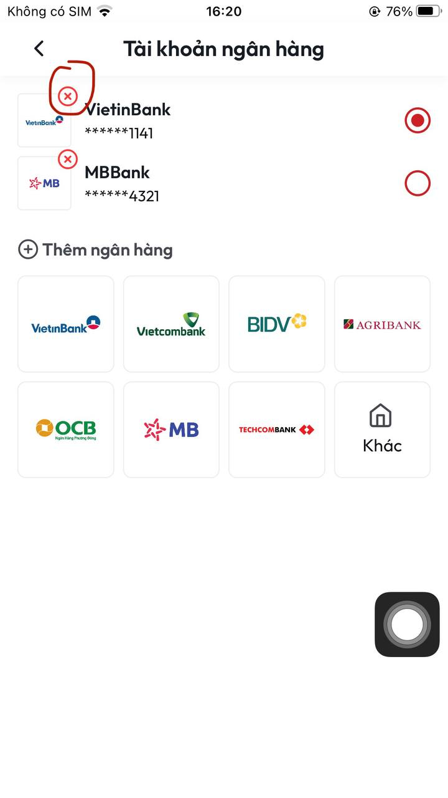<figcaption></figcaption></figure>

**B16:** Sau khi thực hiện **B15** tài khoản ngân hàng của bạn sẽ còn lại ngân hàng chưa bị xoá&#x20;
