# Hướng dẫn tuỳ chỉnh Câu lạc bộ, livestream, tạo sự kiện trong Câu lạc bộ

(\*) Lưu ý: Để có thể tuỳ chỉnh Club, livestream, tạo sự kiện Club điều kiện bắt buộc là bạn phải tạo được Club trước đó, để có thể tạo được Club vui lòng xem **Hướng dẫn tạo Club mới**

**I. TUỲ CHỈNH CÂU LẠC BỘ**\
**B1:** Tại màn **Chi tiết câu lạc bộ** chọn **Đã tham gia** \

<figure>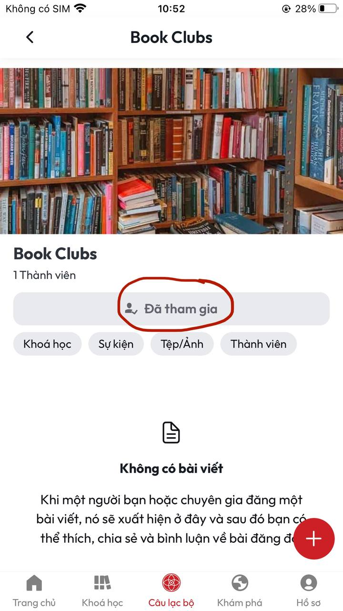<figcaption></figcaption></figure>

**B2:** Sau khi thực hiện xong **B1** màn hình sẽ hiển thị nút **Cài đặt câu lạc bộ** ở phía bên dưới màn hình

<figure>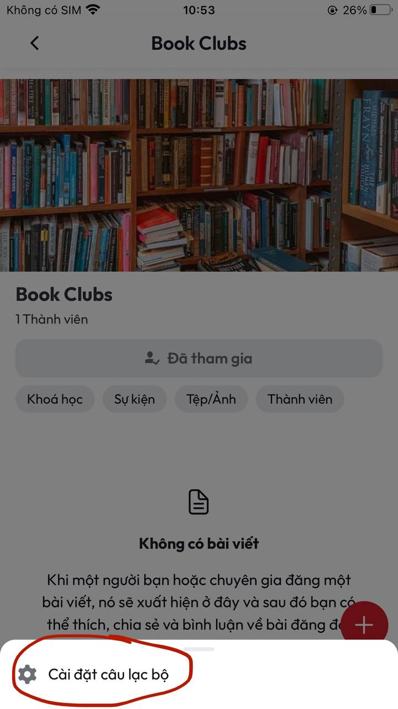<figcaption>
<em>Nút Cài đặt câu lạc bộ ở màn Chi tiết câu lạc bộ</em>
</figcaption></figure>

**B3:** Sau khi ấn vào nút **Cài đặt câu lạc bộ** sẽ vào màn hình **Cài đặt câu lạc bộ**\

<figure>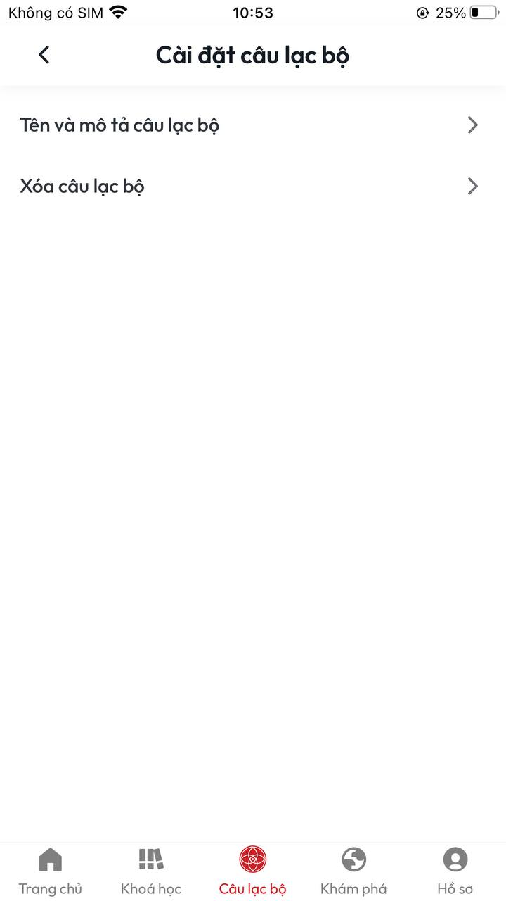<figcaption>
<em>Màn Cài đặt câu lạc bộ</em>
</figcaption></figure>

**B4:** Để thay đổi các thông tin trong Câu lạc bộ của bạn chọn **Tên và mô tả câu lạc bộ**&#x20;

<figure>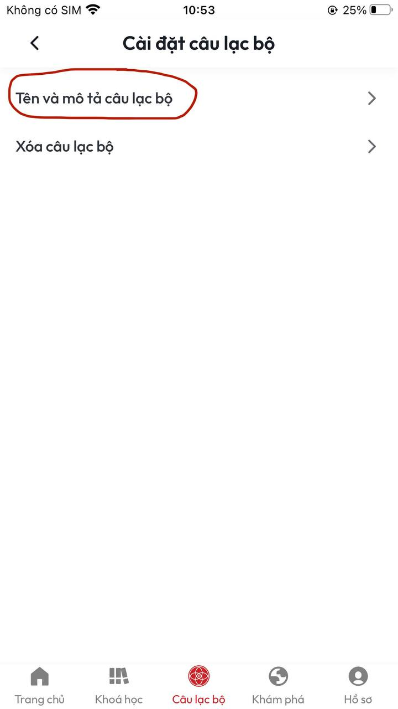<figcaption></figcaption></figure>

**B5:** Sau khi thực hiện xong **B4** sẽ vào màn **Cập nhật câu lạc bộ** sau đó bạn có thể tuỳ chỉnh các thông tin câu lạc bộ theo mong muốn rồi ấn chọn nút **Cập nhật câu bộ** phía bên dưới màn hình

<figure>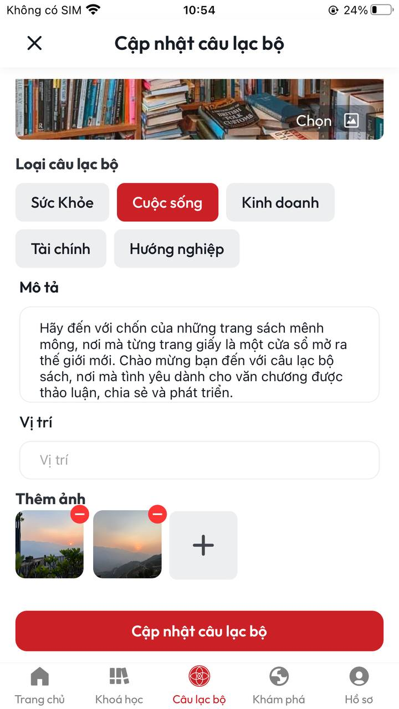<figcaption></figcaption></figure>

**B6:** Sau khi thực hiện xong **B5** sẽ trở về màn **Cài đặt câu lạc bộ** và hiển thị thông báo **Cập nhật câu lạc bộ thành công** lúc này câu lạc bộ của bạn đã được thay đổi theo ý bạn mong muốn

<figure><figcaption></figcaption></figure>

**B7:** Để thực hiện **Xoá câu lạc bộ** của bạn vui lòng thực hiện xong **B2** sẽ đến màn hình **Cài đặt câu lạc bộ**. Tại màn này bạn chọn **Xoá câu lạc bộ**&#x20;

<figure><figcaption></figcaption></figure>

**B8:** Sau khi thực hiện xong **B7** màn hình sẽ hiển thị Popup **Xác nhận xoá** &#x20;

<figure>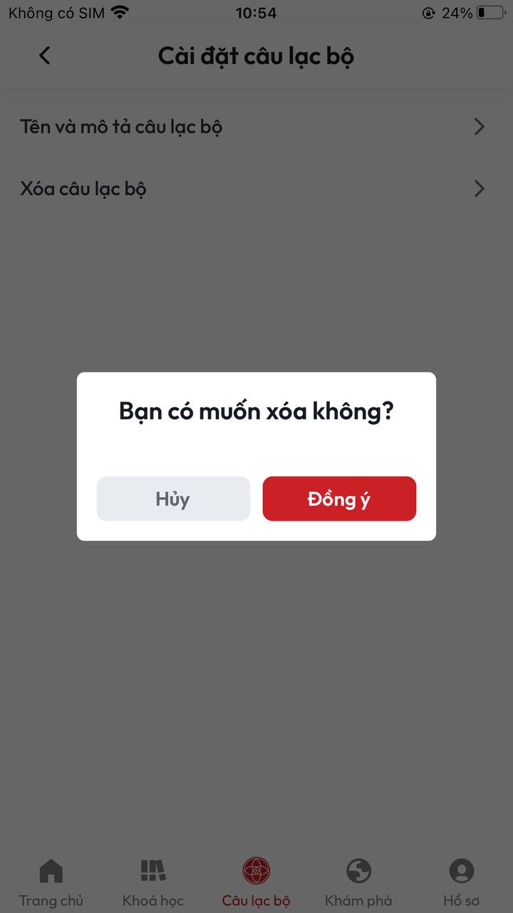<figcaption>
<em>Popup xác nhận Xoá câu lạc bộ</em>
</figcaption></figure>

**B9:** Tại **B8** nếu bạn chọn **Đồng ý** tại Popup **Xác nhận xoá** lúc này sẽ trờ về màn **Cầu lạc bộ** đồng thời hiển thị thông báo **Xoá câu lạc bộ thành công**

<figure>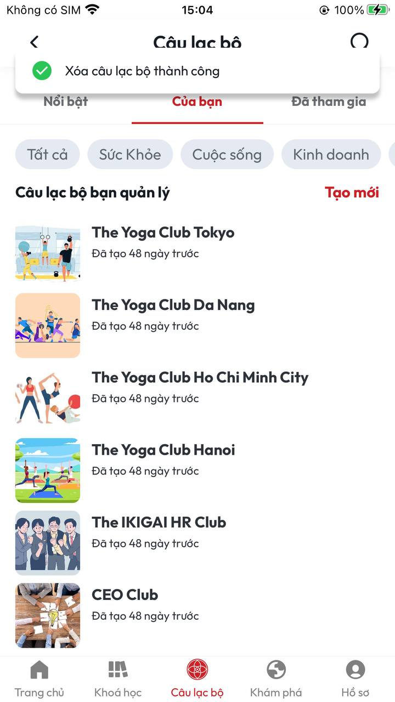<figcaption></figcaption></figure>

**II. TẠO SỰ KIỆN TRONG CÂU LẠC BỘ**

**B1:** Tại màn **Chi tiết câu lạc bộ** chọn **Sự kiện**&#x20;

<figure>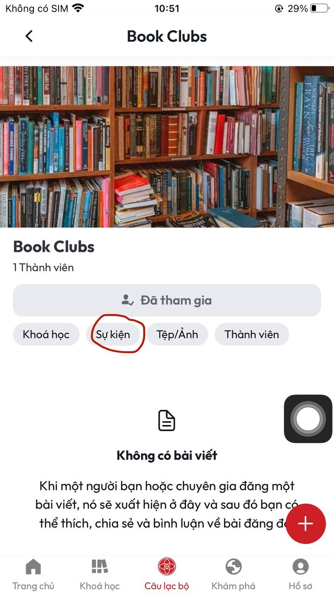<figcaption></figcaption></figure>

**B2:** Sau khi thực hiện xong **B1** sẽ vào màn **Sự kiện**

<figure>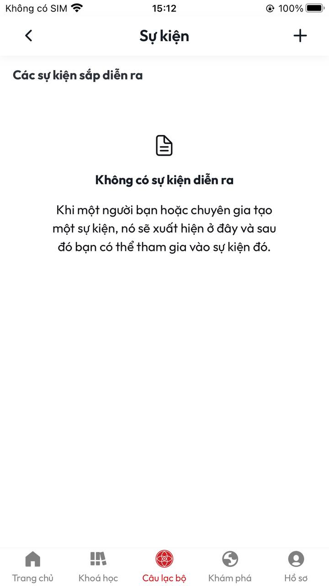<figcaption>
<em>Màn Sự kiện</em>
</figcaption></figure>

**B3:** Để tạo **Sự kiện** cho **Câu lạc bộ** ấn chọn dấu **+** ở phía trên cùng bên trái màn hình&#x20;

<figure>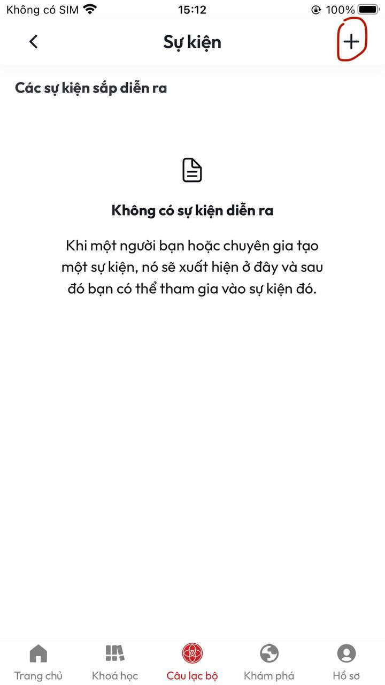<figcaption></figcaption></figure>

**B4:** Sau khi thực hiện xong **B3** sẽ vào màn **Tạo sự kiện**&#x20;

<figure>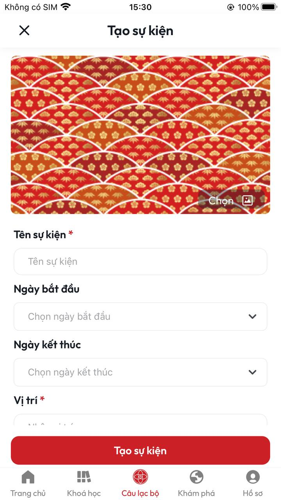<figcaption>
<em>Màn Tạo sự kiện</em> 
</figcaption></figure>

**B5:** Sau khi nhập đầy đủ thông tin tại màn **Tạo sự kiện** ấn vào nút **Tạo sự kiện**

<figure>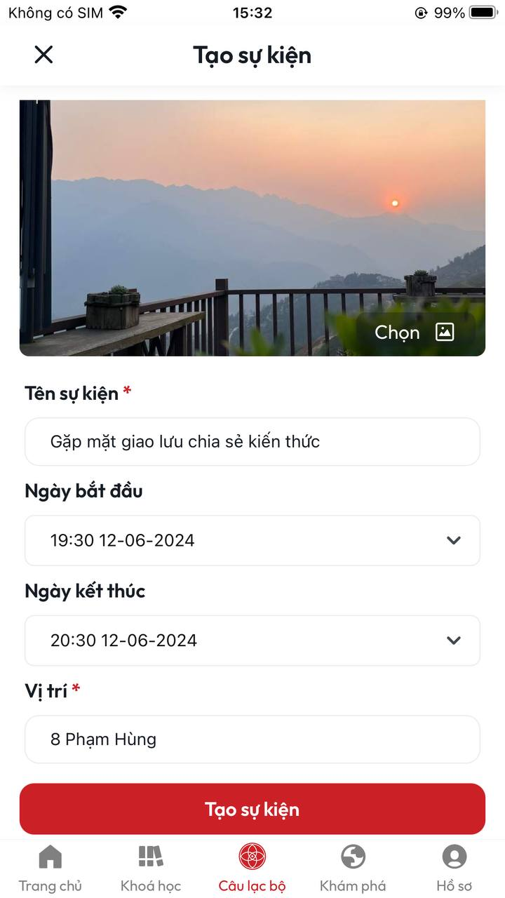<figcaption></figcaption></figure>

B6:&#x20;
