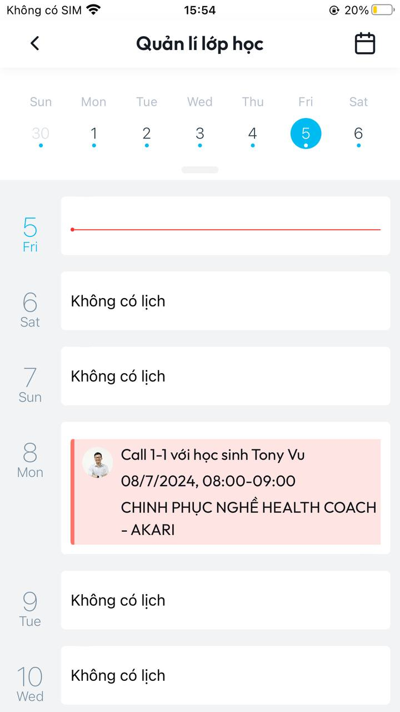

# Hướng dẫn Xem lịch dạy

**B1:** Tại màn **Trang chủ** ấn chọn biểu tượng **Lịch** phía trên bên phải màn hình

<figure><figcaption>
<em>Màn Trang chủ</em>
</figcaption></figure>

**B2:** Sau khi thực hiện xong **B1** sẽ vào màn **Quản lý lớp học.** Tại đây bạn có thể xem lịch học của mình với học sinh&#x20;

<figure><figcaption>
<em>Màn Quản lý lớp học</em>
</figcaption></figure>

