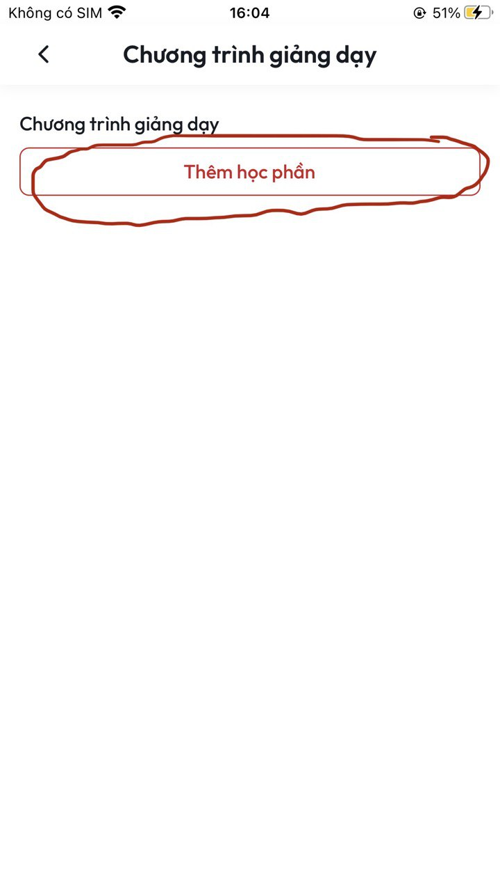

# \[Self-learning] Hướng dẫn đăng tải video và tài liệu

**B1:** Tại màn **Chi tiết khoá học** ấn chọn nút **Chỉnh sửa nội dung khoá học**&#x20;

<figure><figcaption>
<em>Màn Chi tiết khoá học</em> 
</figcaption></figure>

**B2:** Sau khi thực hiện xong **B1** sẽ vào màn **Chương trình giảng dạy.** Tại đây ấn chọn nút **Thêm học phần**&#x20;

<figure><figcaption>
<em>Màn Chương trình giảng dạy</em>
</figcaption></figure>

**B3:** Sau khi thực hiện xong **B4** sẽ vào màn **Thêm học phần.** Tại màn này bạn nhập:

* **Tiều đề học phần (Bắt buộc):** Tại đây bạn nhập tiêu đề cho học phần của bạn&#x20;

<figure><figcaption>
<em>Màn Thêm học phần</em>
</figcaption></figure>

B4:&#x20;
